<h1 align="center">Why Spain Won The 2026 World Cup</h1>
<p align="center"><i>A tournament told through data — built end-to-end in Python from real Opta-sourced match data</i></p>

<p align="center">
  <a href="output/spain_wc2026_report.pdf"><b>📄 Open the full PDF report (15 pages)</b></a>
</p>

<p align="center">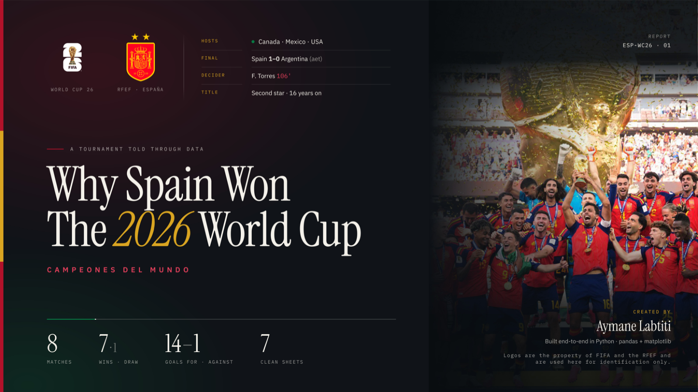</p>

<p align="center">
  <b>8</b> matches &nbsp;·&nbsp; <b>7</b> wins, 1 draw &nbsp;·&nbsp; <b>14–1</b> goals &nbsp;·&nbsp; <b>7</b> clean sheets<br>
  <sub>Golden Ball: Rodri &nbsp;·&nbsp; Golden Glove: Unai Simón &nbsp;·&nbsp; Best Young Player: Pau Cubarsí</sub>
</p>

---

## The report

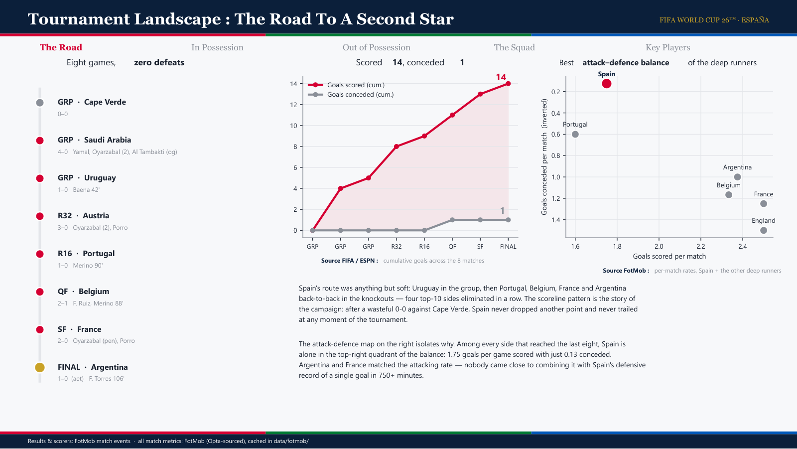

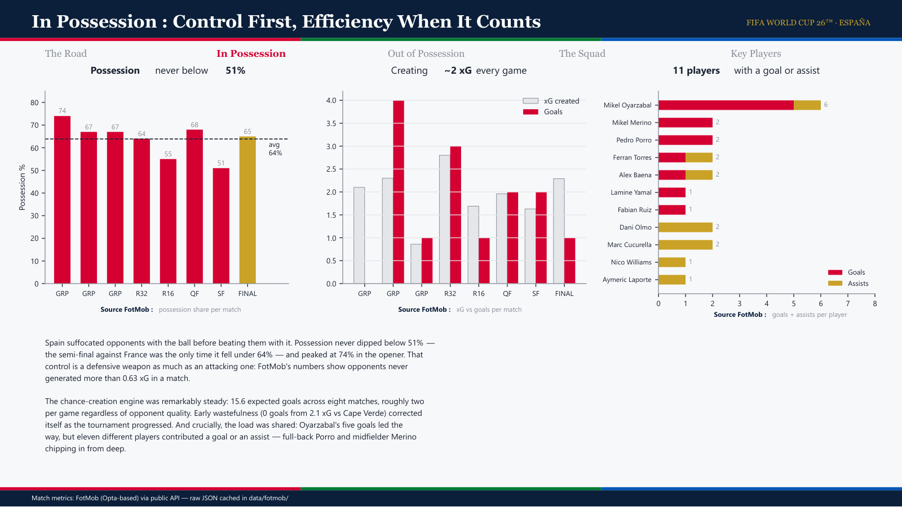

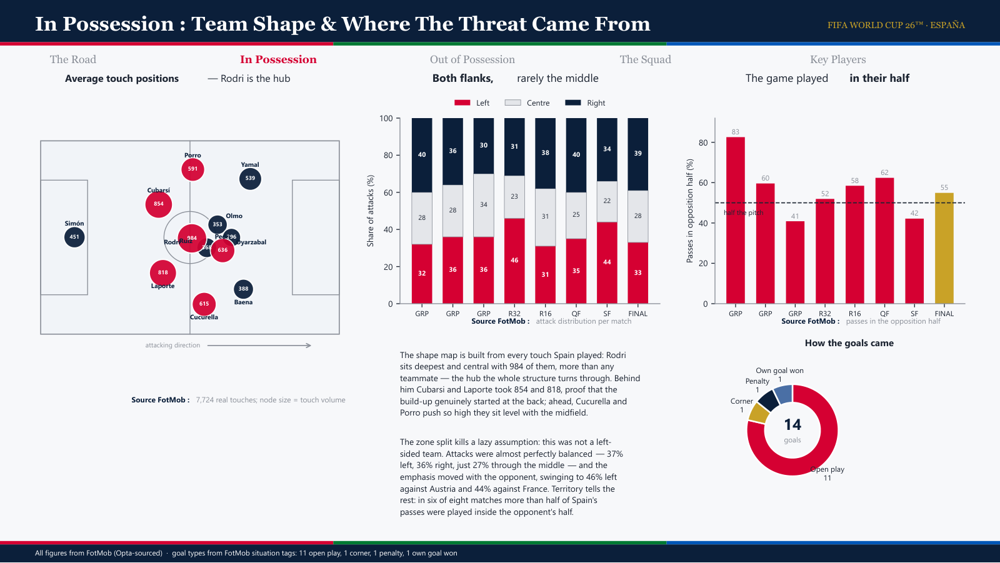

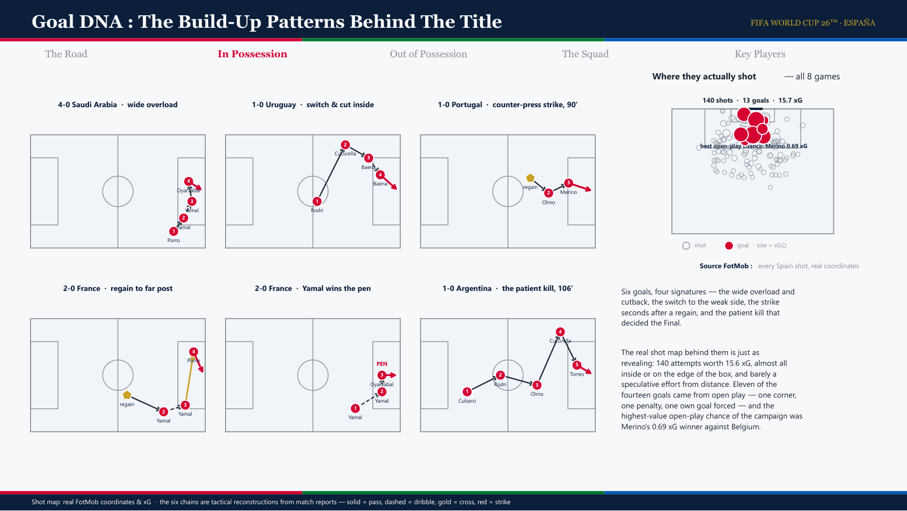

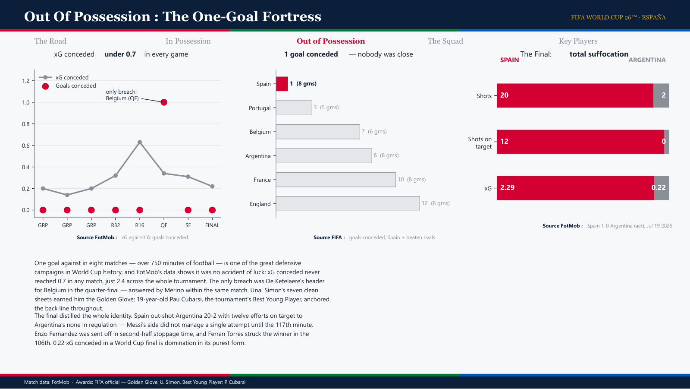

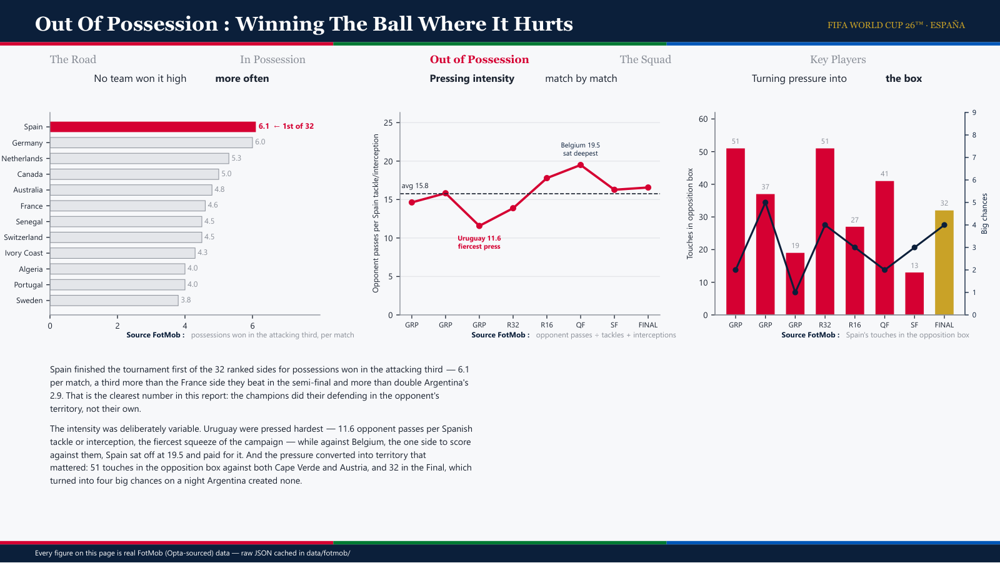

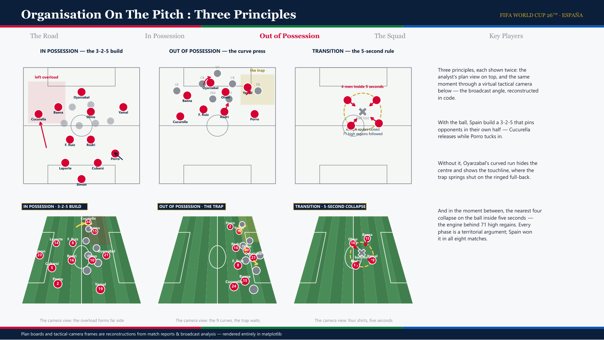

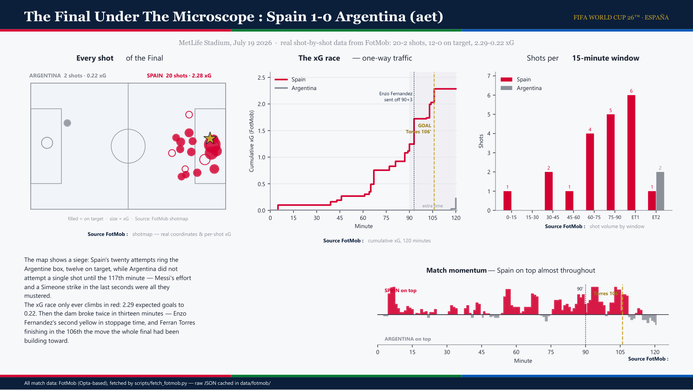

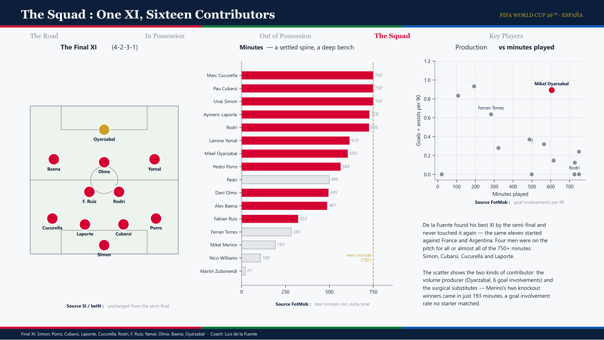

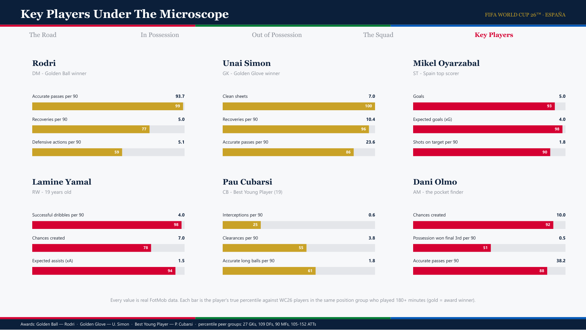

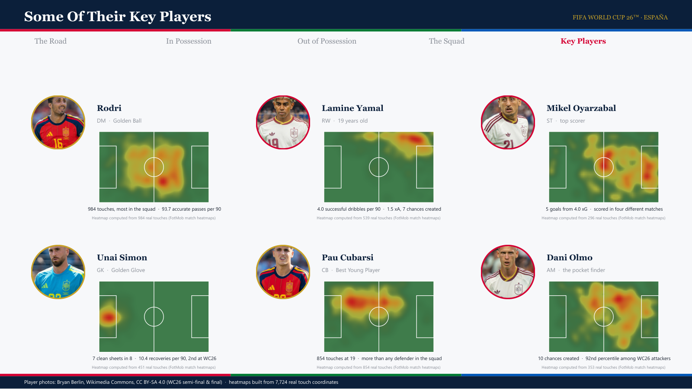

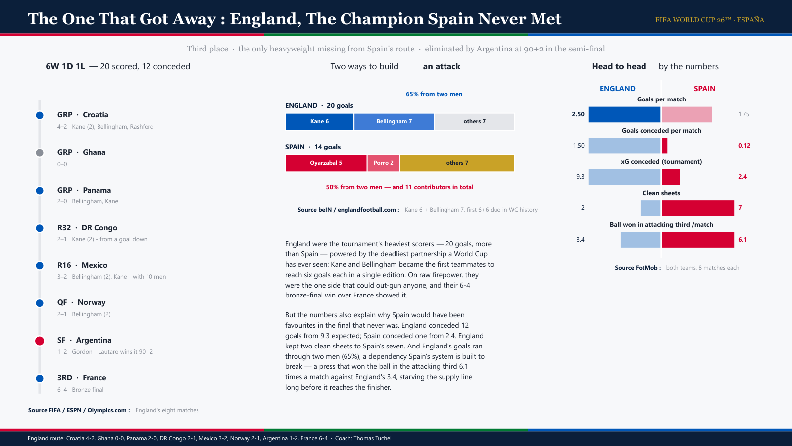

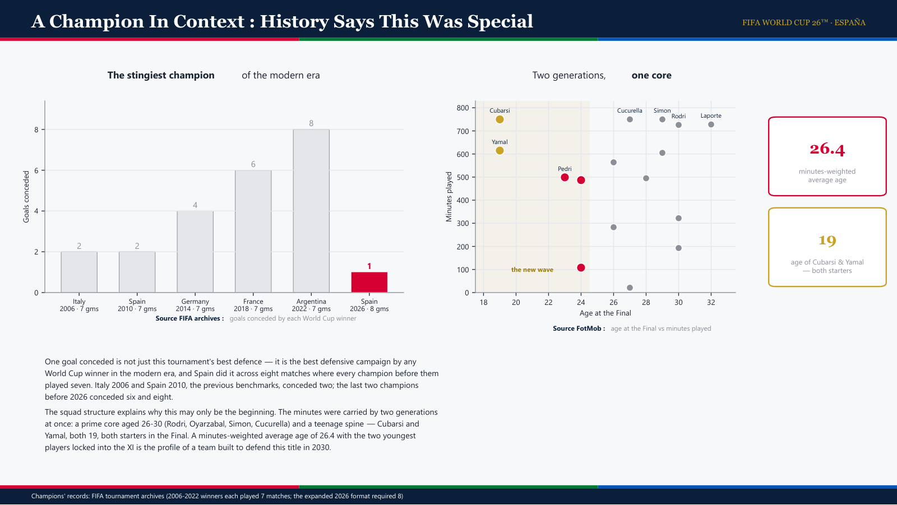

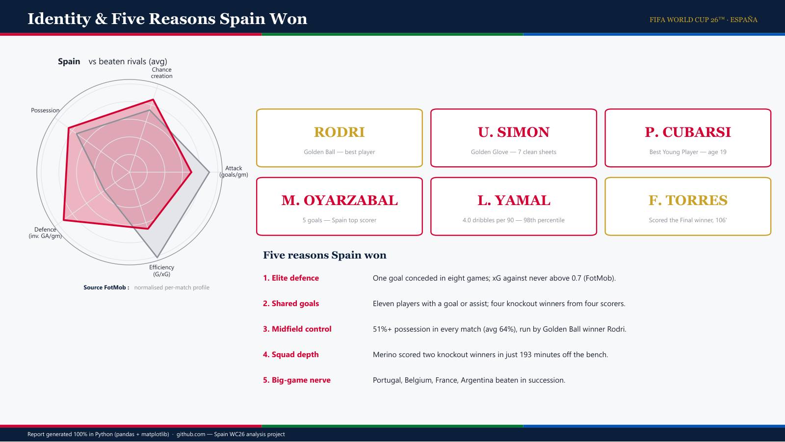

<p align="center">
  <a href="output/spain_wc2026_report.pdf"><b>📄 Download the PDF</b></a>
</p>

---

<details>
<summary><b>How it was built</b> — pipeline, data provenance and sources</summary>

<br>

Two scripts do everything: one pulls real match data from FotMob's public API
(Opta-sourced), the other renders the 15-page PDF with pandas + matplotlib.
No chart is drawn by hand.

```bash
pip install -r requirements.txt
python scripts/fetch_fotmob.py     # pull real match data (cached after first run)
python src/build_report.py         # render the PDF
python scripts/export_previews.py  # refresh the page images in this README
```

### Data provenance

**All quantitative content is real.** `scripts/fetch_fotmob.py` caches every raw
JSON response under `data/fotmob/`, so any number in the report can be traced
back to its source:

| Layer | What is real |
|---|---|
| Match metrics | xG for/against (open play and set play split), possession, shots, shots on target, touches in the opposition box, big chances, passes by half, tackles, interceptions |
| Shots | All 140 Spain attempts and both teams' Final shotmaps — true pitch coordinates, per-shot xG, outcome and situation tag |
| Players | Minutes, goals, assists and ages for all 16 players used; 7,724 touch coordinates parsed from FotMob's per-match heatmaps |
| Percentiles | Computed against every WC26 player in the same position group with 180+ minutes (383-player feeds) |
| Tournament context | Team rankings across all 48 teams — including possessions won in the attacking third, where Spain finished 1st of the 32 ranked sides |
| The Final | Minute-by-minute momentum, cumulative xG, shot timings |

Two categories are *not* measurements, and both say so on the page:

- **Tactical diagrams** — the three principle boards, the tactical-camera frames
  and the six goal build-up chains. These illustrate analysis the way a coach's
  whiteboard does; pass-by-pass event chains are not available from any public
  source.
- **Editorial facts** — the route, awards, Final XI, red card and England's
  results, from [FIFA](https://www.fifa.com/en/tournaments/mens/worldcup/canadamexicousa2026/final),
  [ESPN](https://www.espn.com/soccer/match/_/gameId/760517/argentina-spain),
  [Sports Illustrated](https://www.si.com/soccer/spain-vs-argentina-confirmed-lineups-2026-world-cup-final)
  and [Yahoo Sports](https://sports.yahoo.com/articles/no-yamal-golden-ball-boot-225800390.html).

### What the real data changed

Working from measurements rather than assumptions overturned three things an
earlier draft had guessed at — a useful reminder of why provenance matters:

- Spain were **not** a left-sided team. The real attacking-zone split is 37% left,
  36% right, 27% centre: two-footed, and re-weighted per opponent.
- **Pau Cubarsí is not a high-volume defender** (25th percentile for interceptions
  among centre-backs). Spain defended by denying the ball, not by winning tackles
  — he took 854 touches, more than any other defender in the squad.
- The Final was even more one-sided than reported: **20-2 on shots and 12-0 on
  target**, with Argentina's first attempt arriving in the 117th minute.

</details>

<details>
<summary><b>Project structure</b></summary>

<br>

```
├── data/                          # every file below is written by the fetch script
│   ├── fotmob/                    # raw cached API responses — the audit trail
│   ├── matches.csv                # per-match xG, possession, shots, passes, duels
│   ├── all_shots.csv              # all 140 Spain shots: coords, xG, situation
│   ├── final_shots.csv            # the Final's full shotmap (both teams)
│   ├── final_momentum.csv         # minute-by-minute momentum of the Final
│   ├── player_touches.csv         # 7,724 real touch coordinates
│   ├── player_positions.csv       # average touch position + volume per player
│   ├── players.csv                # minutes, goals, assists, ages
│   ├── player_profiles.csv        # key-player metrics + true position percentiles
│   ├── league_team_stats.csv      # tournament-wide rankings, all 48 teams
│   ├── teams_comparison.csv       # Spain, the sides it beat, and England
│   ├── attacking_zones.csv        # left/centre/right attack split per match
│   ├── goal_types.csv             # goals by FotMob situation tag
│   ├── champions_history.csv      # goals conceded by past winners (FIFA archives)
│   ├── england_matches.csv        # England's route (match reports)
│   └── goal_chains.csv            # the six goal diagrams (tactical reconstruction)
├── scripts/
│   ├── fetch_fotmob.py            # pulls & shapes all real data
│   ├── export_previews.py         # renders the PDF pages into docs/preview/
│   └── fetch_api_football.py      # optional API-Sports loader (needs a free key)
├── src/
│   ├── config.py                  # visual identity: palette, typography, geometry
│   ├── charts.py                  # reusable chart builders (each draws into an Axes)
│   ├── pages.py                   # page layouts: header bands, commentary, cards
│   └── build_report.py            # entry point: data -> figures -> multi-page PDF
└── output/
    └── spain_wc2026_report.pdf
```

**Designed cover** — if `assets/cover_page.pdf` exists (a cover designed outside
the pipeline), the build stitches it in as page 1 with `pypdf`, auto-rotating a
portrait canvas that holds landscape artwork, and skips the generated title page.

</details>

<details>
<summary><b>Assets &amp; licensing</b></summary>

<br>

`assets/wc26_emblem.png` is the official FIFA World Cup 26™ emblem, from the
[Wikipedia article's media](https://en.wikipedia.org/wiki/File:2026_FIFA_World_Cup_emblem.svg),
used solely to identify the tournament in a non-commercial fan analysis. All
trademarks belong to FIFA.

`assets/photos/` contains in-match photographs from the WC26 semi-final and final
by **Bryan Berlin**, published on
[Wikimedia Commons](https://commons.wikimedia.org/w/index.php?search=Argentina+v+Spain+19+July+2026)
under **CC BY-SA 4.0** (player portraits are the cropped versions used by the
players' Wikipedia articles).

Tactic boards are original drawings. Player heatmaps are **computed** (2D
histogram + gaussian kernel smoothing) from `data/player_touches.csv` — 7,724
real touch coordinates parsed out of FotMob's per-match heatmap payloads, one
point per touch.

Layout language (header bands, section navigation, chart + commentary + source
line per panel, percentile player cards) is inspired by professional scouting
reports; the colour theme follows the FIFA World Cup 26 host-nation identity.

</details>
